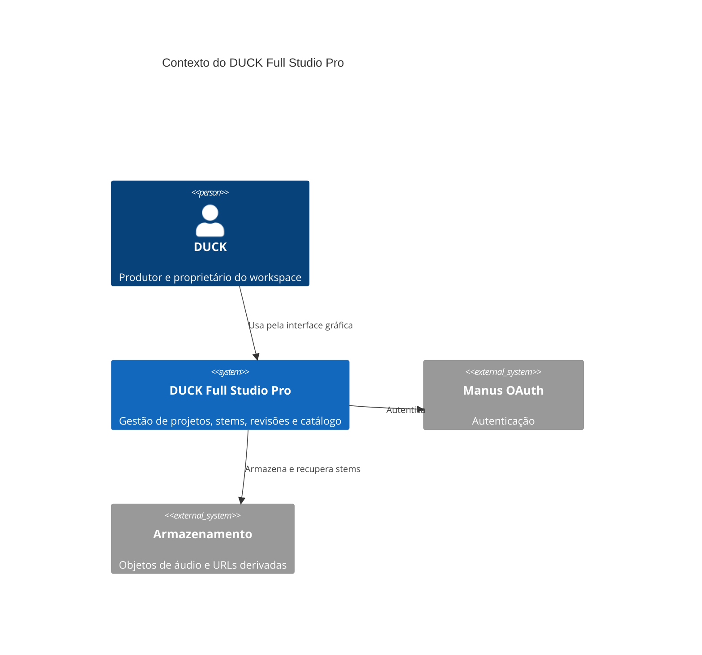
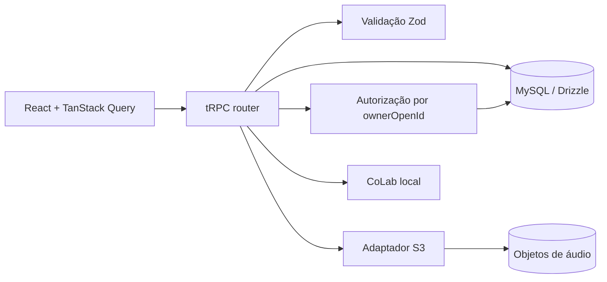

# Arquitetura do DUCK Full Studio Pro

## Visão geral

O produto segue uma adaptação pragmática de arquitetura limpa. A interface React trata apresentação e interação. O router tRPC é o adaptador de transporte. Os módulos `server/duckStudio/` concentram regras de validação, acesso, armazenamento, catálogo e CoLab. MySQL persiste metadados e o armazenamento externo mantém os bytes dos stems.

## Domínio

| Entidade | Responsabilidade | Integridade |
|---|---|---|
| Projeto | Agrupa produção, artista, BPM, tonalidade e progresso. | Proprietário obrigatório para acesso privado. |
| Stem | Referência um arquivo armazenado e seu estado de revisão. | Só é lido ou atualizado após validar o projeto do proprietário. |
| Comentário | Observação ligada a um instante de áudio. | Timestamp entre zero e 24 horas. |
| Auditoria | Registra criação, upload, comentário e mudança de status. | Vinculada ao proprietário que originou o evento. |
| Catálogo | Referências de ferramentas e licenças. | Fontes verificadas são marcadas; entradas sem fonte não são instaladores. |

## Camadas e responsabilidades

| Local | Papel |
|---|---|
| `client/src/` | Apresentação, estados de interface e consumo tRPC. |
| `server/duckStudioRouters.ts` | Adaptador tRPC e composição dos casos de uso. |
| `server/duckStudio/validation.ts` | Contratos Zod e regras de entrada reutilizáveis. |
| `server/duckStudio/access.ts` | Controle de propriedade e escrita de auditoria. |
| `server/duckStudio/stemStorage.ts` | Sanitização do nome e apresentação segura de URLs de stem. |
| `server/duckStudio/catalog.ts` | Catálogo legal de referências. |
| `server/duckStudio/colab.ts` | Respostas locais transparentes do assistente. |
| `drizzle/schema.ts` | Modelo físico e índices de consulta. |

## Segurança e limites

O `ownerOpenId` limita projetos, stems, comentários, logs e geração de links. O sistema não possui ainda token de portal externo nem expiração/revogação por cliente. Arquivos grandes ainda transitam por base64 no servidor, portanto o limite atual é defensivo e não substitui upload multipart.
